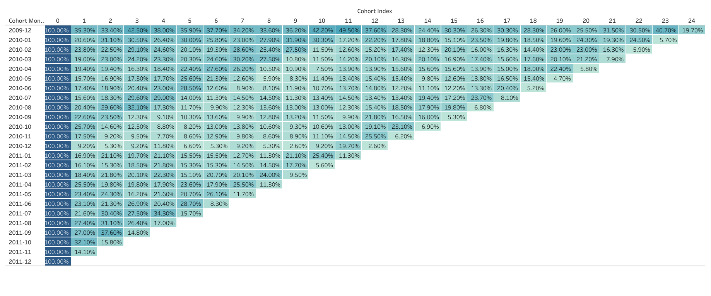
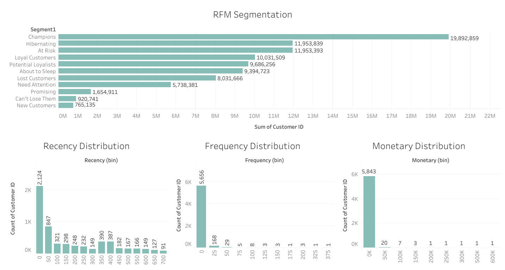

# 📊 Customer Retention & Segmentation Analysis — Online Retail II


Analisis retensi pelanggan dan segmentasi customer menggunakan **Cohort Analysis** dan **RFM (Recency, Frequency, Monetary) Segmentation** pada dataset UCI Online Retail II, untuk mengidentifikasi pola churn dan customer bernilai tinggi.

📈 **[View Interactive Dashboard on Tableau Public](<!-- TODO: paste link Tableau Public kamu di sini -->)**

---

## 📌 Table of Contents
- [Business Problem](#business-problem)
- [Dataset](#dataset)
- [Methodology](#methodology)
- [Key Findings](#key-findings)
- [Business Recommendations](#business-recommendations)
- [Tech Stack](#tech-stack)
- [Repository Structure](#repository-structure)
- [How to Run](#how-to-run)

---

## Business Problem

Retail bisnis sering kehilangan pelanggan tanpa menyadari **kapan** dan **mengapa** hal itu terjadi. Tanpa memahami pola retensi dan nilai pelanggan, tim marketing kesulitan mengalokasikan budget campaign secara efektif.

Project ini menjawab dua pertanyaan utama:
1. **Kapan** pelanggan mulai berhenti bertransaksi setelah pembelian pertama? *(Cohort Analysis)*
2. **Siapa** pelanggan paling bernilai yang harus diprioritaskan untuk retention campaign? *(RFM Segmentation)*

## Dataset

- **Sumber:** [UCI Machine Learning Repository — Online Retail II](https://archive.ics.uci.edu/dataset/502/online+retail+ii)
- **Periode:** Desember 2009 – Desember 2011 (24 bulan)
- **Jumlah transaksi:** <!-- TODO -->
- **Jumlah unique customer:** 5,878
- **Cakupan:** Transaksi online retail berbasis UK, mencakup invoice, produk, quantity, harga, dan customer ID.

## Methodology

### 1. Data Cleaning
- Menghapus transaksi dengan `CustomerID` null
- Menghapus cancelled orders (invoice berawalan 'C')
- Menangani outlier pada quantity & harga negatif

### 2. Cohort Analysis
- Mengelompokkan customer berdasarkan bulan transaksi pertama (*cohort month*)
- Menghitung retention rate tiap cohort dari bulan ke bulan
- Visualisasi heatmap retention untuk melihat pola drop-off

### 3. RFM Segmentation
- **Recency:** Berapa lama sejak transaksi terakhir
- **Frequency:** Seberapa sering customer bertransaksi
- **Monetary:** Total nilai pembelian
- Scoring tiap dimensi (1-5) → dikombinasikan jadi segment (contoh: *Champions*, *At Risk*, *Loyal Customers*, *Lost*)

## Key Findings

### 🔥 Cohort Retention Heatmap


Retention mengalami **churn cliff** yang tajam pada bulan pertama: dari 24 cohort bulanan (Des 2009–Des 2011), rata-rata hanya **21% customer** yang kembali bertransaksi di bulan ke-1 setelah pembelian pertama — artinya **~79% customer hilang** hanya dalam satu bulan. Setelah melewati titik kritis ini, retention rate cenderung stabil di kisaran 15-30% untuk core customer yang bertahan, dengan fluktuasi lebih tinggi pada bulan-bulan akhir akibat mengecilnya ukuran sampel cohort.

**Implikasi:** window re-engagement paling krusial ada di **30 hari pertama** setelah pembelian awal — di sinilah intervensi (onboarding email, follow-up promo) punya dampak terbesar terhadap retention jangka panjang.

### 🎯 RFM Customer Segments


Dari total **5,878 customer**, segmentasi menunjukkan pola tipikal retail: **Champions** adalah segment terbesar (~22% dari customer base, ≈1,299 customer), diikuti **Lost Customers** (~15%, ≈897 customer) — basis loyal yang cukup kuat, namun juga porsi signifikan customer yang sudah churn total. Segment **At Risk** (~6%, ≈362 customer) masih punya peluang diselamatkan lebih cepat dibanding yang sudah masuk kategori Lost.

Distribusi RFM juga sangat *right-skewed*: **99% customer** melakukan transaksi di bawah 50 kali (Frequency) dan spending terkonsentrasi di bin terendah (Monetary), menandakan mayoritas adalah occasional buyer sementara segelintir *"whale customer"* mendominasi volume — pola klasik yang jadi alasan RFM scoring memakai skor persentil/quintile, bukan nilai mentah, agar tidak bias ke outlier.

<!-- CATATAN: angka segment di atas adalah estimasi (total sum ÷ rata-rata Customer ID), karena chart Tableau masih pakai agregasi Sum bukan Count. Disarankan fix agregasi ke COUNTD di Tableau lalu update angka final di sini. -->
<!-- TODO: crop watermark "Activate Windows" dari screenshot sebelum upload final -->


## Business Recommendations

1. **Perkuat onboarding di 30 hari pertama** — dengan 79% customer churn setelah bulan pertama, prioritaskan email sequence / follow-up promo otomatis segera setelah first purchase, bukan menunggu tanda-tanda inactivity muncul.
2. **Segment "At Risk"** (~6% dari customer base, ≈362 customer) → luncurkan win-back campaign dengan diskon personal sebelum mereka jatuh ke kategori "Lost".
3. **Segment "Champions"** (~22% dari customer base, ≈1,299 customer) → prioritaskan untuk loyalty program / early access produk baru, mengingat kontribusinya paling besar terhadap revenue.
4. **Mayoritas customer (99%) adalah occasional buyer** (frequency rendah) → fokuskan strategi akuisisi-ke-repeat melalui targeted promo pasca pembelian pertama, alih-alih menunggu mereka jadi frequent buyer secara organik.

## Tech Stack

| Kategori | Tools |
|---|---|
| Data Processing | Python (Pandas, NumPy) |
| Analysis | Jupyter Notebook |
| Visualization | Tableau Public |
| Version Control | Git & GitHub |

## Repository Structure

```
online-retail-cohort-rfm/
├── README.md
├── notebooks/
│   └── cohort_rfm_analysis.ipynb
├── data/
│   └── online_retail_II.csv          # atau link ke UCI jika file besar
├── visualizations/
│   ├── cohort_retention.png
│   └── rfm_segments.png
└── requirements.txt
```

## How to Run

```bash
# Clone repository
git clone https://github.com/<!-- TODO: username -->/online-retail-cohort-rfm.git
cd online-retail-cohort-rfm

# Install dependencies
pip install -r requirements.txt

# Jalankan notebook
jupyter notebook notebooks/cohort_rfm_analysis.ipynb
```

---

**📫 Contact:** <!-- TODO: LinkedIn / email kamu -->
